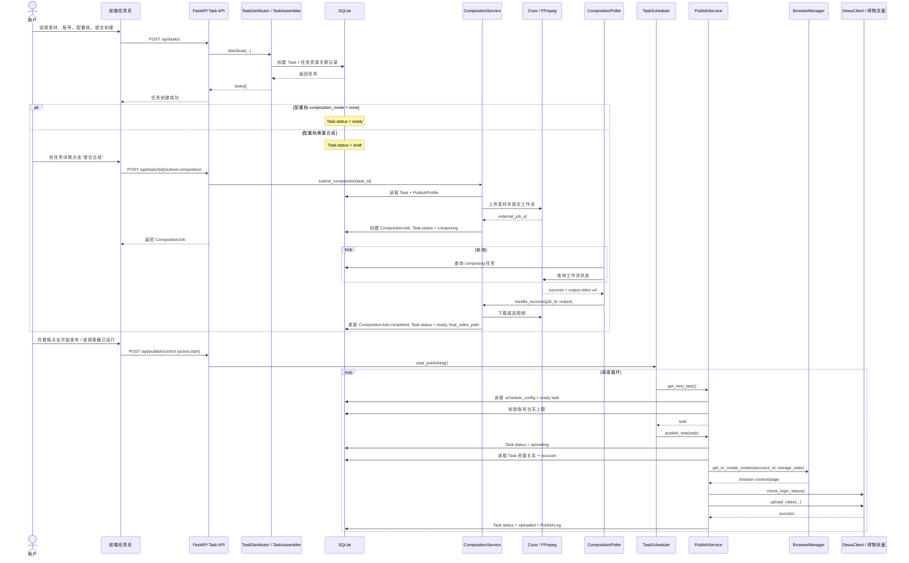

# 任务从创建到发布成功的完整时序图

## 1. 文档范围

这份文档描述的是当前项目里，一条任务从“用户在前端创建”到“最终发布成功”的完整链路。

基于当前代码，任务有两条主路径：

1. 不需要合成：创建后直接进入 `ready`，再被调度上传
2. 需要合成：创建后先进入 `draft`，提交合成后进入 `composing`，成功产出成品视频后再进入 `ready`

本文优先以当前实现为准，关键代码入口包括：

- `frontend/src/pages/task/TaskCreate.tsx`
- `frontend/src/pages/task/TaskDetail.tsx`
- `backend/api/task.py`
- `backend/services/task_distributor.py`
- `backend/services/task_assembler.py`
- `backend/services/composition_service.py`
- `backend/services/scheduler.py`
- `backend/services/publish_service.py`
- `backend/core/browser.py`
- `backend/core/dewu_client.py`

## 2. 总体状态流

```text
创建任务
→ draft 或 ready

若需要合成：
draft
→ composing
→ ready

统一进入发布链：
ready
→ uploading
→ uploaded
```

失败分支本文只顺带说明，主线聚焦“最终成功”的路径。

## 3. 时序图总览



## 4. 创建阶段

### 4.1 前端动作

用户在 `TaskCreate` 页面做这些事：

1. 选账号
2. 选配置档
3. 向素材篮子里添加视频、文案、封面、音频
4. 点击创建

前端入口：

- `frontend/src/pages/task/TaskCreate.tsx`
- `frontend/src/hooks/useTask.ts` 里的 `useBatchAssemble`

实际发起的是：

```text
POST /api/tasks/
```

请求体里包含：

- `video_ids`
- `copywriting_ids`
- `cover_ids`
- `audio_ids`
- `topic_ids`
- `account_ids`
- `profile_id`
- `name`

### 4.2 后端动作

后端在 `backend/api/task.py` 里先校验资源和账号是否存在，然后调用：

- `TaskDistributor.distribute(...)`

`TaskDistributor` 的职责是：

```text
1 份素材集合 x N 个账号 = N 个 Task
```

也就是：

- 用户选了 3 个账号
- 同一套素材会创建 3 条任务

### 4.3 任务组装

真正落库是在 `TaskAssembler.assemble(...)` 完成的：

1. 解析 `PublishProfile`
2. 判断初始状态
3. 合并配置档里的全局话题
4. 写入 `tasks`
5. 写入 `task_videos`
6. 写入 `task_copywritings`
7. 写入 `task_covers`
8. 写入 `task_audios`
9. 写入 `task_topics`

初始状态规则：

- `profile.composition_mode == "none"` -> `ready`
- 其他模式 -> `draft`

## 5. 合成阶段

这一步只发生在任务创建后状态是 `draft` 的情况下。

### 5.1 前端触发

用户进入任务详情页，在 `TaskDetail` 页面点击“提交合成”。

对应接口：

```text
POST /api/tasks/{task_id}/submit-composition
```

### 5.2 后端提交合成

`CompositionService.submit_composition(task_id)` 做的事情是：

1. 读取任务
2. 校验当前状态必须是 `draft`
3. 解析任务关联的 `PublishProfile`
4. 判断 `composition_mode`

如果模式是 `coze`：

1. 读取 `coze_workflow_id`
2. 从 profile 读取 `composition_params`
3. 找视频素材
4. 上传视频到 Coze，拿到 `file_id`
5. 提交异步工作流，拿到 `external_job_id`

然后统一做两件事：

1. 创建 `composition_jobs` 记录
2. 把 `tasks.status` 改成 `composing`

### 5.3 轮询阶段

后台的 `CompositionPoller` 会周期性扫描：

```text
status = composing 的任务
```

它的逻辑是：

1. 找任务
2. 找该任务最新的 `CompositionJob`
3. 读取 `workflow_id` 和 `external_job_id`
4. 调 `CozeClient.check_status(...)`

### 5.4 合成成功

如果外部返回成功：

1. `CompositionService.handle_success(...)` 被调用
2. 下载成品视频到本地
3. 更新 `composition_jobs.status = completed`
4. 更新 `tasks.final_video_path`
5. 更新 `tasks.status = ready`

到这里，任务正式从“可编辑草稿”切换成“待上传任务”。

## 6. 调度阶段

### 6.1 启动调度器

调度一般由 Dashboard 的“开始发布”触发：

```text
POST /api/publish/control
body: { action: "start" }
```

后端进入：

- `scheduler.start_publishing()`
- 异步创建 `_publish_loop()`

### 6.2 任务选择逻辑

调度循环每一轮都会：

1. 读取 `schedule_config`
2. 调 `PublishService.get_next_task()`

这个方法会做 3 层筛选：

1. 当前时间是否在允许时段内
2. 是否有 `status = ready` 的任务
3. 当前账号是否已达每日发布上限

如果满足条件，选择：

```text
优先级最高 + 创建最早 的 ready 任务
```

## 7. 发布执行阶段

### 7.1 进入 uploading

`PublishService.publish_task(task)` 的第一步就是：

```text
Task.status = uploading
```

这意味着从这里开始，任务已经进入不可编辑的执行区间。

### 7.2 预加载资源

然后后端重新查询任务，并预加载：

- `Task.videos`
- `Task.copywritings`
- `Task.audios`
- `Task.topics`
- `Task.covers`

再读取账号：

- `Account`

并检查：

- 账号存在
- 账号状态是 `active`

### 7.3 浏览器上下文恢复

之后会进入浏览器层：

1. `get_dewu_client(account.id)`
2. `browser_manager.get_or_create_context(account.id, account.storage_state)`
3. 如果已有页面则复用
4. 否则新建页面

这一步的意义是：

- 优先复用账号已有 session
- 避免每次发任务都重新登录

### 7.4 登录态校验

正式上传前会做一次：

```text
client.check_login_status()
```

如果 session 已失效：

- 任务会被标记为 `failed`
- 错误信息一般是“登录已过期”

成功路径里，这一步通过后才会继续。

### 7.5 填充发布素材

当前发布服务读取资源的方式是“集合里取第一个”：

- 视频：`task.videos[0].file_path`
- 文案：`task.copywritings[0].content`
- 话题：把 `task.topics` 拼成字符串
- 封面：`task.covers[0].file_path`

然后调用：

```text
client.upload_video(
  video_path=...,
  title=...,
  content=...,
  topic=...,
  cover_path=...,
  product_link=None
)
```

这里是当前实现上的一个重要现实：

- 虽然任务模型已经支持多资源集合
- 但真正发布时仍然只消费每类资源的第一项

### 7.6 发布成功

如果 `upload_video(...)` 返回成功：

1. `Task.status = uploaded`
2. `Task.publish_time = now`
3. `Task.error_msg = null`
4. 写入一条 `PublishLog`

到这里，一条任务完成“从创建到发布成功”的完整主线。

## 8. 成功路径分步清单

如果只想看简化版，可以按下面理解：

1. 用户在任务创建页选素材、账号、配置档
2. 前端调用 `POST /api/tasks/`
3. 后端为每个账号创建一条任务
4. 若配置档无需合成，任务直接 `ready`
5. 若需要合成，任务先 `draft`
6. 用户在详情页点击提交合成
7. 后端创建 `CompositionJob`，任务变 `composing`
8. 轮询器等外部工作流完成
9. 下载成品视频，任务变 `ready`
10. Dashboard 启动发布调度器
11. 调度器选出一个 `ready` 任务
12. 发布服务恢复账号浏览器上下文
13. DewuClient 检查登录态并打开上传流程
14. 自动上传视频、填写文案和话题
15. 成功后任务标记为 `uploaded`
16. 写入发布日志

## 9. 关键状态变化表

| 阶段 | 触发点 | Task.status |
|------|--------|-------------|
| 创建后无需合成 | `TaskAssembler` | `ready` |
| 创建后需要合成 | `TaskAssembler` | `draft` |
| 提交合成 | `CompositionService.submit_composition` | `composing` |
| 合成成功 | `CompositionService.handle_success` | `ready` |
| 开始发布 | `PublishService.publish_task` | `uploading` |
| 发布成功 | `TaskService.mark_task_uploaded` | `uploaded` |

## 10. 当前实现里对时序理解最重要的 4 个点

### 10.1 “创建任务”和“提交合成”是两步

任务创建并不等于自动开始合成。只有用户在详情页点击“提交合成”，任务才会从 `draft` 进入 `composing`。

### 10.2 合成和发布是两条串行流水

合成完成只是把任务推进到 `ready`，真正发布仍然依赖独立的调度器和发布服务。

### 10.3 浏览器 session 是这条链的关键依赖

没有有效的 `storage_state`，任务即使到了 `ready`，发布阶段也会因为登录失效而失败。

### 10.4 当前“多素材任务”在发布阶段仍然是单资源消费

这意味着模型层和执行层之间还没有完全对齐。时序上看，任务能关联多资源；执行上看，发布仍主要消费第一条资源。
