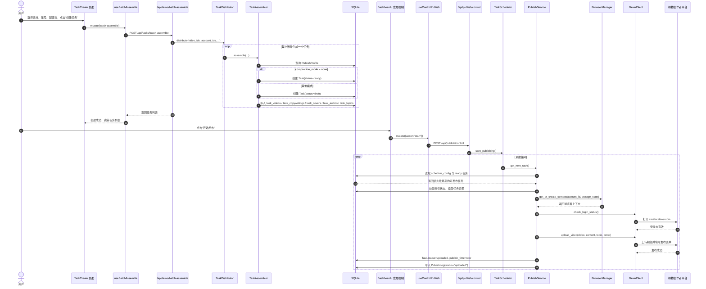
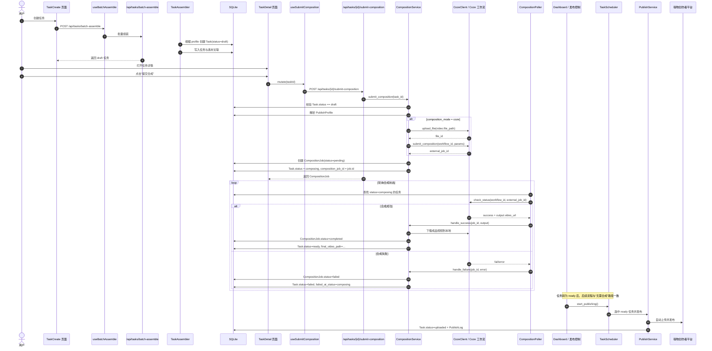

# 任务从创建到发布成功的完整时序图

## 1. 文档范围

这份文档描述当前项目里“任务从创建到最终发布成功”的真实执行链路，并区分两种路径：

1. 不需要合成，直接进入待上传
2. 需要合成，先经过 Coze / 合成轮询，再进入待上传

说明基于当前代码，而不是只基于设计文档。

## 2. 关键参与者

- 用户
- 前端页面 `TaskCreate` / `TaskDetail` / `Dashboard`
- 前端 hooks：`useBatchAssemble`、`useSubmitComposition`、`useCompositionStatus`、`useControlPublish`
- 后端 API：`/api/tasks/*`、`/api/publish/*`
- `TaskDistributor`
- `TaskAssembler`
- `TaskService`
- `CompositionService`
- `TaskScheduler`
- `PublishService`
- `BrowserManager`
- `DewuClient`
- SQLite
- Coze 工作流
- 得物创作者平台

## 3. 路径 A：无需合成的任务

适用条件：

- 任务绑定的 `PublishProfile.composition_mode = "none"`
- 或没有显式 profile，但默认 profile 的模式也是 `none`

### 时序图

### 当前代码锚点

- 任务创建入口：`backend/api/task.py:298`
- 分发器：`backend/services/task_distributor.py`
- 组装器：`backend/services/task_assembler.py`
- 调度启动：`backend/api/publish.py:97`
- 调度循环：`backend/services/scheduler.py:36`
- 发布执行：`backend/services/publish_service.py`

## 4. 路径 B：需要合成的任务

适用条件：

- `PublishProfile.composition_mode = "coze"` 或其他非 `none` 模式

### 时序图

### 当前代码锚点

- 提交合成端点：`backend/api/task.py:318`
- 合成服务：`backend/services/composition_service.py`
- 合成轮询器：`backend/services/scheduler.py:135`
- 任务详情页的合成动作：`frontend/src/pages/task/TaskDetail.tsx:112`

## 5. 任务状态变化总表

| 阶段 | 触发入口 | 任务状态变化 | 主要落库内容 |
|------|----------|--------------|--------------|
| 创建任务 | `POST /api/tasks/batch-assemble` | `ready` 或 `draft` | `tasks` + 任务素材关联表 |
| 提交合成 | `POST /api/tasks/{id}/submit-composition` | `draft -> composing` | `composition_jobs` + `tasks.composition_job_id` |
| 合成成功 | 轮询器回调 | `composing -> ready` | `final_video_path`、作业完成状态 |
| 合成失败 | 轮询器回调 | `composing -> failed` | `error_msg`、`failed_at_status` |
| 开始上传 | 调度器选中任务 | `ready -> uploading` | 任务状态更新 |
| 发布成功 | `PublishService` | `uploading -> uploaded` | `publish_time`、`PublishLog` |
| 发布失败 | `PublishService` | `uploading -> failed` | `error_msg`、`failed_at_status`、`PublishLog` |

## 6. 前端实际参与点

### 6.1 创建阶段

- 页面：`frontend/src/pages/task/TaskCreate.tsx`
- 关键 hook：`useBatchAssemble`
- 关键组件：
  - `ProductQuickImport`
  - `MaterialSelectModal`

### 6.2 合成阶段

- 页面：`frontend/src/pages/task/TaskDetail.tsx`
- 关键 hooks：
  - `useSubmitComposition`
  - `useCompositionStatus`
  - `useCancelComposition`

### 6.3 调度与发布阶段

- 页面：`frontend/src/pages/Dashboard.tsx`
- 关键 hooks：
  - `useControlPublish`
  - `usePublishStatus`

## 7. 当前实现和“理想流程”之间的差异

这里是阅读代码时最容易误解的地方。

### 7.1 “立即发布”端点目前不是真正立即发布

`POST /api/tasks/{id}/publish` 当前只做了：

- 校验任务存在
- 校验任务不在 `uploading`
- 打一条“已添加到发布队列”的日志
- 直接返回成功

它没有直接调用 `PublishService.publish_task()`，也没有强制让调度器立即消费这个任务。

见：

- `backend/api/task.py:240-255`

### 7.2 发布控制当前只启动任务调度器

发布控制入口 `POST /api/publish/control` 调用的是：

- `scheduler.start_publishing()`

这会启动 `TaskScheduler`，但不会启动 `CompositionPoller`。

见：

- `backend/api/publish.py:105-113`
- `backend/services/scheduler.py:26-34`
- `backend/services/scheduler.py:283-321`

### 7.3 轮询器存在统一管理器，但当前发布入口没走它

代码里已经有 `SchedulerManager.start_all()`，它会同时启动：

- `TaskScheduler`
- `CompositionPoller`

但当前发布 API 还没有调用它。

## 8. 建议如何理解这条链路

如果只用一句话总结当前真实流程：

1. 创建任务时，任务先落到 `ready` 或 `draft`
2. 需要合成的任务先走 `CompositionJob`
3. 真正的上传动作由后台调度器循环触发
4. 发布成功后状态和日志再回写数据库

换句话说，系统的真正执行入口不是“任务详情页按钮本身”，而是：

- 合成入口：`/api/tasks/{id}/submit-composition`
- 发布入口：`/api/publish/control`

