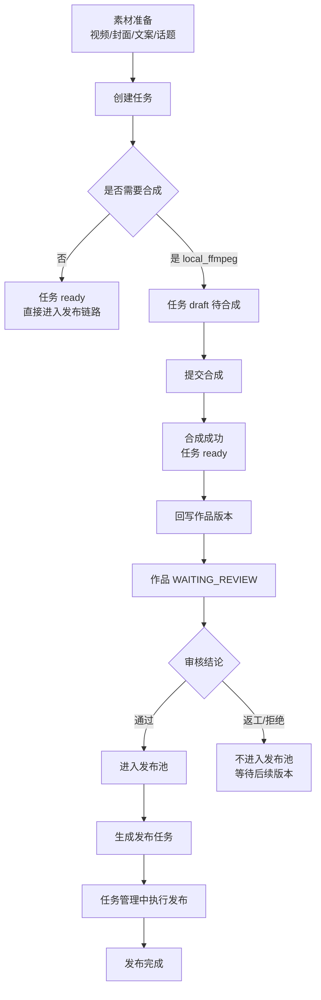

# 一个完整作品的全过程实例说明

## 目的

这份文档不用抽象术语，而是用一个具体例子，说明当前系统里：

- 素材是什么
- 任务是什么
- 作品是什么
- 合成、审核、发布之间是什么关系
- 用户每一步应该去哪个页面操作

---

## 一句话先讲清楚

当前系统不是“直接从素材手工创建一个作品，再手工发布”的设计。

更准确地说，当前主链路是：

> **素材准备 → 创建任务 → 执行合成/发布 → 回写作品版本 → 审核作品 → 进入发布池 → 生成发布任务 → 执行发布**

所以：

- **Task（任务）** 是执行对象
- **Creative（作品）** 是业务对象
- **作品工作台** 看业务推进
- **任务管理** 看执行推进
- **Dashboard** 看系统运行态

---

## 示例：做一个“白橙空军一号短视频作品”

下面用一个完整例子说明。

### 例子设定

假设现在要做一条作品：

- 商品：Nike Air Force 1 Low 白橙
- 目标：生成一个可审核、可发布的视频作品
- 已有素材：
  - 1 个原始视频素材
  - 1 条文案
  - 1 张封面图
  - 若干话题
  - 可选 1 条背景音频

我们希望最后得到的是：

1. 一个可审核的作品版本
2. 审核通过后进入发布池
3. 再生成真正的发布任务
4. 最终完成发布

---

## 1. 素材准备阶段

### 用户在做什么

先把业务所需内容准备好：

- 商品信息
- 视频素材
- 封面图
- 文案
- 话题
- 音频（如果需要）

### 这一步的数据形态

这一层还只是“原料”，不是最终作品。

也就是说，此时系统里有的是：

- Material / Asset
- Product / 商品信息
- 可能还没有真正进入“作品版本”

### 用户应该去哪

- 素材管理
- 商品/解析相关入口

---

## 2. 创建任务阶段

### 用户在做什么

用户进入 **任务创建页**，选择这次要执行的素材组合。

例如：

- 选 1 个视频素材
- 选 1 条文案
- 选 1 张封面
- 选多个话题
- 选择合成配置：`local_ffmpeg`
- 账号可以不选

### 这里系统到底创建了什么

这一步创建的首先是 **Task（任务）**，不是直接创建“已完成作品”。

任务里会记录：

- 这次要用哪些素材
- 这次任务属于什么执行类型
- 是否需要合成
- 后续是否要发布
- 关联哪个作品项（如果有）

### 两种常见模式

当前系统里，至少有两类执行起点：

#### 模式 A：无需合成

如果配置是：

- `composition_mode = none`

那么系统认为这次输入已经是“可直接发布”的最终输入，任务初始状态会直接进入：

- `ready`

这就是你之前看到的“当前为直接发布模式”的来源。

#### 模式 B：需要合成

如果配置是：

- `composition_mode = local_ffmpeg`

那么系统认为还需要先合成，任务初始状态会进入：

- `draft`

也就是“待合成”。

### 这个例子里采用哪种

这个例子里，我们选择的是：

- `local_ffmpeg`

所以任务创建完成后，不会直接发布，而是会先进入：

- **待合成（draft）**

### 用户应该去哪

- 创建：任务创建页
- 创建成功后：任务管理

---

## 3. 合成阶段

### 用户在做什么

用户到 **任务管理** 里找到刚创建的这条任务，然后点击：

- 提交合成

### 系统在做什么

后端由合成服务接手：

- 校验任务当前必须是 `draft`
- 调用本地合成链路（例如 `local_ffmpeg`）
- 产出最终视频文件
- 把最终产物写回任务

### 典型状态变化

这条任务的状态大致会经历：

```text
draft（待合成）
  -> composing（合成中）
  -> ready（合成完成，待后续执行）
```

### 合成成功后会发生什么

除了任务本身变为 `ready` 之外，系统还会尝试把这次合成结果**回写到作品域**：

- 生成新的作品版本
- 把这个版本激活为当前版本
- 作品状态进入：
  - `WAITING_REVIEW`

### 这一点非常关键

也就是说：

> **任务合成成功，不等于直接完成业务闭环；它只是把“执行结果”回写成一个待审核的作品版本。**

### 用户应该去哪

- 看执行过程：任务管理
- 合成成功后看业务结果：作品工作台 / 作品详情

---

## 4. 作品回写与待审核阶段

### 用户会看到什么

合成成功后，这条“白橙空军一号短视频”会以一个**新的作品版本**出现在作品域里。

这时你在 **作品工作台** 里看到的，不是“某个底层任务”，而是：

- 这个作品现在有一个新版本
- 当前状态是待审核
- 是否已进发布池
- 是否需要返工

### 为什么这里要切换到作品工作台

因为从这一刻开始，关注点已经变了：

- 在任务管理里，你关注的是“合成有没有跑完”
- 在作品工作台里，你关注的是“这个结果能不能作为业务作品继续往下走”

### 用户应该去哪

- 作品工作台
- 作品详情

---

## 5. 审核阶段

### 用户在做什么

用户在作品详情里查看：

- 视频结果是否符合预期
- 封面是否正确
- 文案是否正确
- 是否需要返工

然后给出审核结论：

- 通过
- 返工
- 拒绝

### 三种结果分别代表什么

#### 通过

说明这个版本可以进入后续发布链路。

系统会把它同步进：

- 发布池

#### 返工

说明作品可以继续改，但当前版本不能直接进入发布池。

系统会把当前发布池有效项失效掉，等待后续新的版本。

#### 拒绝

说明当前版本不应继续流转。

同样不会进入发布池。

### 这个例子里怎么走

假设这次审核通过。

那么这条“白橙空军一号短视频作品”就会进入：

- **发布池**

### 用户应该去哪

- 审核：作品工作台 / 作品详情
- 查执行失败：任务管理

---

## 6. 进入发布池阶段

### 发布池代表什么

发布池不是“已经发布”，而是：

> **这个作品版本在业务上已经被认可，可以进入发布规划。**

也就是说，这一步回答的是：

- 哪个作品版本可以拿去做正式发布

而不是：

- 它已经实际上传到了外部平台

### 用户应该理解成什么

审核通过后，作品进入的是“可发布候选态”，还没真正执行平台发布。

---

## 7. 发布规划阶段

### 系统在做什么

当系统从发布池里挑出这条作品准备发布时，会做两件事：

1. 先保存一份发布执行快照
2. 再基于原任务信息克隆出一个真正的 **发布任务**

这个发布任务的特点通常是：

- `task_kind = publish`
- `status = ready`

### 为什么还要再建一个发布任务

因为“审核通过”是业务判断，
而“真正上传到平台”仍然是一次**可追踪、可失败、可重试的执行动作**。

所以它仍然需要一个 Task 来承接执行责任。

### 用户应该去哪

- 看发布执行：任务管理

---

## 8. 发布执行阶段

### 用户在做什么

用户在 **任务管理** 里看到这条新的发布任务，可以继续观察：

- 是否已就绪
- 是否提交发布
- 是否发布成功
- 是否失败，需要重试

### 系统在做什么

发布器会使用这条任务里的最终视频、文案、封面、话题、账号等信息，执行实际上传。

### 结果

如果执行成功，这条任务会进入发布完成态。

而业务上，这个作品也就完成了一次从内容生成到正式发布的完整闭环。

---

## 9. 这个例子的全链路串起来是什么样



---

## 10. 用“页面视角”再讲一遍

如果还是觉得抽象，可以按“我应该去哪个页面”来理解。

| 阶段 | 你在处理什么 | 应该去哪里 |
| --- | --- | --- |
| 准备素材 | 视频、封面、文案、话题 | 素材管理 |
| 创建执行 | 把素材组合成一次可执行任务 | 任务创建 |
| 发起合成 | 让系统产出最终视频 | 任务管理 |
| 看业务结果 | 看这个结果是否成为可用作品版本 | 作品工作台 / 作品详情 |
| 做审核 | 决定通过、返工、拒绝 | 作品工作台 / 作品详情 |
| 看是否可发布 | 确认是否进入发布池 | 作品工作台 |
| 执行真实发布 | 真正上传平台、处理失败重试 | 任务管理 |
| 看系统是否健康 | 调度器、发布器、运行摘要 | Dashboard |

---

## 11. 最容易混淆的点

## 11.1 为什么不是“直接从素材创建作品”？

因为当前系统的执行真相是：

- 任务负责把素材真正跑起来
- 作品负责承接业务真相与审核真相

所以更准确地说是：

> **素材先进入任务执行链，再把执行结果沉淀为作品版本。**

---

## 11.2 为什么合成成功后还要审核？

因为“合成成功”只说明技术执行完成了，不说明业务结果就可以直接对外发布。

例如：

- 视频拼接成功了，但成片不好看
- 封面不对
- 文案不对
- 话题不合适

所以还需要作品审核。

---

## 11.3 为什么审核通过后还不是最终完成？

因为审核通过只说明：

- 这个版本在业务上可用

但是否真正上传成功，还取决于后续发布执行。

所以还需要：

- 发布池
- 发布任务
- 发布执行

---

## 12. 这个例子的最终结论

如果用一句最接地气的话来概括当前设计，可以理解为：

> **任务负责“把东西做出来并跑起来”，作品负责“把结果当成业务内容管理起来”。**

对于“白橙空军一号短视频作品”这个例子，完整过程就是：

1. 准备素材
2. 创建一个需要合成的任务
3. 在任务管理里提交合成
4. 合成成功后回写出新的作品版本
5. 在作品工作台里审核这个版本
6. 审核通过后进入发布池
7. 系统再生成正式发布任务
8. 在任务管理里执行发布
9. 发布成功，形成完整闭环

---

## 13. 对应到当前系统的职责边界

最后再把心智模型压缩成一句：

- **作品工作台**：管“这个作品现在业务上走到哪一步了”
- **任务管理**：管“这个任务现在技术执行到哪一步了”
- **Dashboard**：管“整个系统现在跑得健不健康”

如果按这个模型去理解，当前架构就不会混乱。
