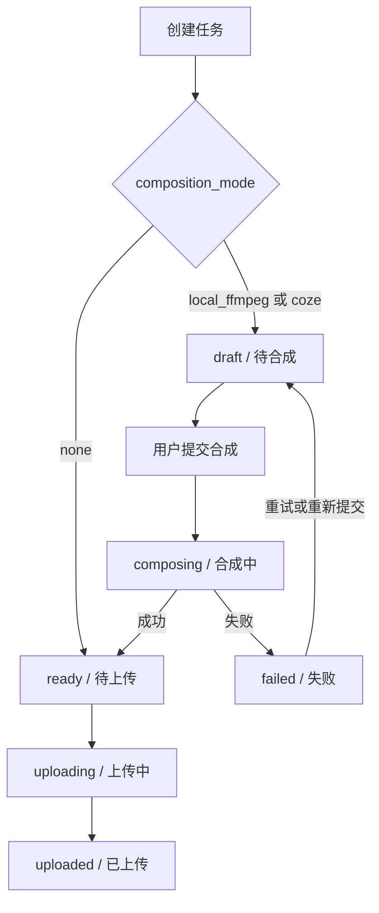

# 任务合成流程说明

## 结论

当前系统把“创建任务”和“启动合成”拆成了两个显式步骤：

1. **创建任务**：先把发布意图、素材绑定、合成配置固化成 Task。
2. **提交合成**：只有需要合成的任务，才会继续进入合成链路。

因此，任务创建后进入“待合成”不是异常，而是当前设计的正常状态。

---

## 用户操作路径

### 直接发布模式（`composition_mode = none`）

1. 在“创建任务”页选择素材与合成配置。
2. 创建后任务直接进入 **待上传**。
3. 后续由发布链路消费 `ready` 任务。

### 合成模式（`composition_mode = local_ffmpeg / coze`）

1. 在“创建任务”页选择素材与合成配置。
2. 创建后任务进入 **待合成**。
3. 可在 **任务管理列表** 直接点击“提交合成”。
4. 也可进入 **任务详情页** 点击“提交合成”。
5. 合成成功后任务进入 **待上传**。

---

## 状态映射

前端当前显示文案：

- `draft` → 待合成
- `composing` → 合成中
- `ready` → 待上传
- `uploading` → 上传中
- `uploaded` → 已上传

---

## 核心状态流转

---

## 当前前端入口

### 任务创建页

- 创建成功后跳转到任务管理页。
- 页面会展示“本次创建 X 个任务”的提示。
- 如果其中存在待合成任务，可直接点击：
  - **提交本次待合成**
  - **查看待合成**

### 任务管理页

- `draft / 待合成` 的任务在列表操作栏会显示 **提交合成**。
- 这是目前最直接的批量进入后续链路的入口。

### 任务详情页

- 当任务状态为 `draft` 或 `composing` 时，会展示“合成执行”卡片。
- `draft` 状态下可以点击 **提交合成**。
- `composing` 状态下可以查看进度，必要时取消合成。

---

## 后端设计意图

系统当前将“合成”和“发布”分成两个阶段：

### 阶段 1：合成

- 输入：素材集合 + 合成配置
- 输出：`final_video_path`

不同模式：

- `local_ffmpeg`：本地执行 FFmpeg 合成
- `coze`：调用外部工作流合成

### 阶段 2：发布

- 输入：已经产出的最终成片（`final_video_path`）或无需合成的直接发布素材
- 起点状态：`ready`

---

## 为什么用户会感觉“创建后卡住了”

因为旧交互里：

- 创建任务后只看到状态变成“待合成”
- 合成入口主要藏在任务详情页
- 没有在任务列表或创建成功后明显提示“下一步该做什么”

这会让用户误以为系统应该自动继续，而不是等待一次显式提交。

本轮收口后，任务列表和创建完成反馈已经补上了这个缺口。

---

## 代码锚点

- `backend/services/task_assembler.py`
  - 根据 `composition_mode` 决定创建后是 `ready` 还是 `draft`
- `backend/services/composition_service.py`
  - 负责提交合成、创建 CompositionJob、写回 `final_video_path`
- `backend/services/task_service.py`
  - 发布链路从 `ready` 任务开始消费
- `frontend/src/pages/task/TaskCreate.tsx`
  - 创建任务后的下一步引导
- `frontend/src/pages/TaskList.tsx`
  - 任务列表的一键提交合成入口
- `frontend/src/pages/task/TaskDetail.tsx`
  - 任务详情页的合成执行入口与状态展示
