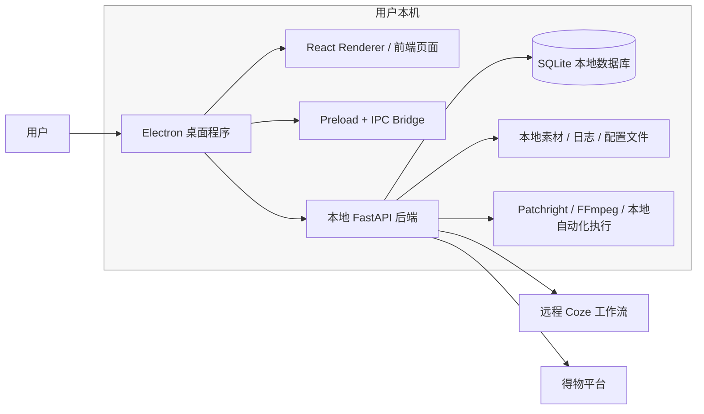
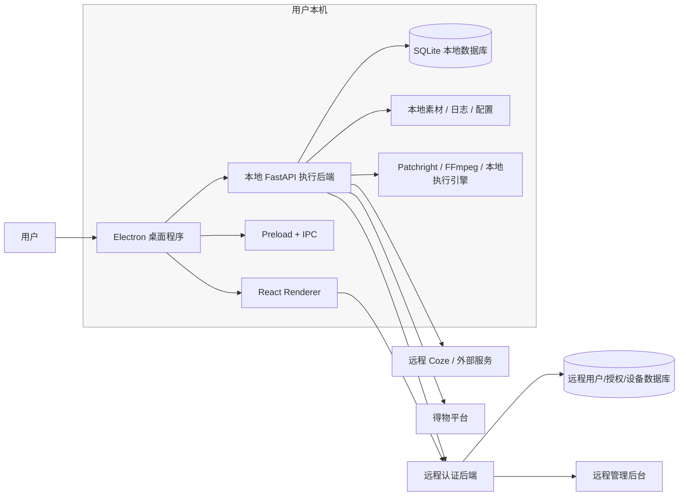
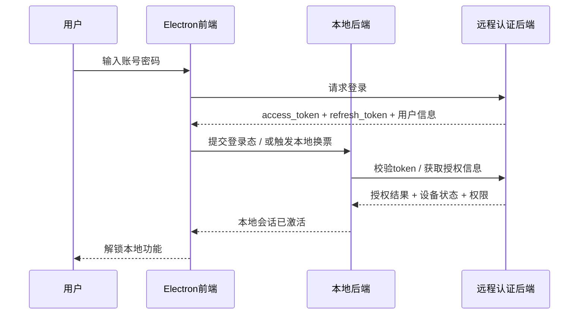
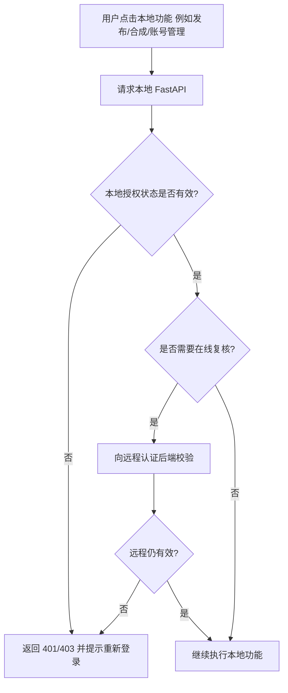

# 本地 / 远程双后端架构分析

> 目的：澄清当前系统架构，并给出“增加远程登录认证后”的目标架构。  
> 日期：2026-04-13

---

## 1. 结论

当前系统已经可以被准确地理解为：

> **Electron 客户端 + 本地前端 + 本地 FastAPI 后端 + 若干远程服务依赖**

其中：

- **Electron 主进程**负责启动本地后端、创建窗口、托盘与 IPC 桥接
- **React 前端**负责页面与交互
- **本地 FastAPI 后端**负责核心业务、SQLite、本地素材、Patchright/FFmpeg 等执行
- **远程服务**目前主要是外部依赖，例如 Coze 工作流平台、得物平台等

如果未来要加“登录到远程系统后才能使用本地功能”，系统就会演化为：

> **Electron 客户端 + 本地执行后端 + 远程认证/控制后端**

这时“有一个本地后端，还有一个远程后端”的说法就完全成立。

---

## 2. 当前架构证据

### 2.1 Electron 负责拉起本地后端

- `frontend/electron/main.ts:186-230`
  - Electron 主进程通过 `spawn(...)` 启动 backend
- `frontend/electron/main.ts:226-229`
  - 通过 `http://127.0.0.1:8000/health` 轮询健康检查
- `frontend/electron/backendLauncher.ts:48-67`
  - 本地后端根目录解析为 `../../backend`
- `frontend/electron/backendLauncher.ts:61`, `68`
  - 后端健康地址是 `http://127.0.0.1:8000/health`

### 2.2 本地前端运行在 Electron 内

- `frontend/src/App.tsx:47-89`
  - React Router 管理整个桌面应用页面
- `frontend/electron/main.ts:47-52`
  - 开发时加载 `http://localhost:5173`
  - 生产时加载本地构建后的 `index.html`

### 2.3 本地后端是真正的业务执行面

- `backend/main.py:30-62`
  - 本地 FastAPI 注册了账号、任务、发布、素材、AI 剪辑、配置等业务路由
- `backend/main.py:105-108`
  - 暴露本地健康检查 `/health`
- `backend/core/config.py:31-69`
  - 本地后端持有 SQLite、Patchright、素材路径、Coze 配置等执行期配置
- `backend/api/system.py:98-136`
  - 本地系统配置与运行配置也由本地后端提供

### 2.4 当前已经存在“远程服务依赖”

- `backend/services/composition_service.py:86-104`
  - 合成模式为 `coze` 时，本地后端会上传素材并提交远程工作流
- `backend/core/coze_client.py:20-28`
  - 使用远程 Coze API 地址和 Token
- `backend/core/coze_client.py:30-76`
  - 会执行远程文件上传、远程工作流提交

所以当前系统不是纯单机闭环，而是：

> **单机业务主控 + 远程服务辅助**

---

## 3. 当前架构图

---

## 4. 为什么现在还不能算“正式双后端业务系统”

因为当前远程侧更多是：

- 第三方平台
- 工作流平台
- 内容/发布目标平台

而不是一个“自己可控的、专门给桌面端做登录授权和控制的远程业务后端”。

换句话说，当前缺的是：

1. **远程用户系统**
2. **远程授权中心**
3. **远程设备绑定 / License 中心**
4. **远程策略下发 / 功能开关 / 停用控制**

---

## 5. 加入远程登录后的目标架构

如果要实现：

> 用户必须先登录远程系统，认证通过后才能使用本地功能

那么建议演化成如下目标架构：

---

## 6. 目标架构中的职责划分

## 6.1 Electron / 前端

负责：

- 登录页
- 登录状态展示
- 用户信息展示
- “未登录 / 已过期 / 已停用”时的 UI Gate
- 向本地后端传递远程访问凭证（或让本地后端自己持有）

不负责：

- 独立判定授权真相
- 独立决定是否允许使用核心功能

因为前端可被绕过，真正的授权闸门必须在本地后端。

---

## 6.2 本地后端

负责：

- 持有本机真实执行能力
- 在调用本地核心能力前检查“是否已通过远程授权”
- 缓存登录态 / token / license 状态
- 在离线策略允许范围内执行
- 记录设备绑定信息、最近校验时间、授权状态

本地后端应成为：

> **功能授权的最终执行闸门**

否则只做前端拦截的话，用户仍然可能绕过 UI 直接调本地 API。

---

## 6.3 远程认证后端

负责：

- 用户登录认证
- 刷新 token
- 设备绑定 / 解绑
- License 校验
- 功能权限与套餐控制
- 封禁 / 停用 / 到期判断
- 可选的远程配置、灰度开关、版本最小要求

这个远程后端才是未来系统里的“第二个真正业务后端”。

---

## 7. 推荐的登录与授权流程

## 7.1 在线登录主流程

---

## 7.2 运行时功能拦截流程

---

## 8. 为什么“授权闸门”必须放在本地后端

因为这个项目不是纯 Web，而是：

- Electron 程序
- 带本地 FastAPI
- 有本地 Patchright / FFmpeg / SQLite / 文件系统执行能力

如果只在前端做登录页拦截，风险是：

1. 用户可绕过前端直接调用本地 API
2. 本地脚本可直接打 `127.0.0.1:8000`
3. 即使 UI 不显示按钮，本地执行能力依旧存在

所以设计原则应是：

> **前端负责显示登录态，本地后端负责真正拦截能力。**

---

## 9. 推荐的落地形态

最稳妥的是采用“三层状态”：

### A. 远程登录态

远程认证后端签发：

- access token
- refresh token
- user id
- license / tenant / role / device binding 信息

### B. 本地授权态

本地后端缓存：

- 当前登录用户
- access token 摘要或加密存储
- refresh token（建议更高保护级别）
- 最近一次成功校验时间
- 离线可用截止时间
- 当前设备 ID

### C. 本地功能门禁

每个敏感 API 前先检查：

- 是否已登录
- token 是否有效
- 设备是否匹配
- license 是否有效
- 当前功能是否被授权

---

## 10. 推荐的阶段化实施

## Phase 1：最小可用登录门禁

目标：

- 增加远程登录
- 未登录时禁止使用本地主要功能

做法：

- 前端增加登录页
- 远程后端提供 `/login /refresh /me`
- 本地后端增加“会话状态检查”
- 发布、任务、素材、账号、系统配置等 API 加统一鉴权依赖

---

## Phase 2：设备绑定与授权模型

目标：

- 一个账号限制登录设备数
- 可远程停用客户端

做法：

- 远程保存 device_id
- 登录时上报 device_id
- 本地后端缓存 device binding 状态

---

## Phase 3：离线容忍策略

目标：

- 允许短时间离线使用
- 超过时间必须重新在线校验

做法：

- 本地保存 `last_verified_at`
- 设置 `offline_grace_period`
- 超过时拒绝核心操作

---

## 11. 对这个仓库最贴合的目标判断

结合当前实现，最适合的目标形态是：

> **Electron 仍然负责壳与 IPC；本地 FastAPI 仍然负责所有本地执行；新增一个远程认证/授权后端作为统一登录与准入中心。**

这样可以保持现有优点：

- 本地自动化能力不丢
- SQLite / Patchright / FFmpeg / 文件系统仍可继续使用
- UI 改动不至于推翻现有结构

同时补上最关键的能力：

- 用户体系
- 授权体系
- 远程停用能力
- 设备绑定
- 本地功能门禁

---

## 12. 参考

- `frontend/electron/main.ts:186-230`
- `frontend/electron/main.ts:281-317`
- `frontend/electron/backendLauncher.ts:48-68`
- `frontend/src/App.tsx:47-89`
- `frontend/electron/preload.ts:7-37`
- `backend/main.py:30-62`
- `backend/main.py:95-108`
- `backend/core/config.py:31-69`
- `backend/api/system.py:98-136`
- `backend/services/composition_service.py:86-104`
- `backend/core/coze_client.py:20-76`

