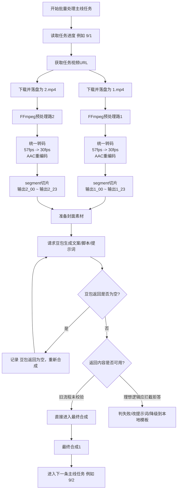

# 运行日志分析：旧版合成流程推断

> 来源日志：`design/运行日志.txt`  
> 分析日期：2026-04-13  
> 说明：本文基于运行日志与当前仓库代码/文档做**证据驱动推断**。  
> 其中“旧版合成流程”是从日志反推出的历史/外部脚本逻辑，**不等同于**当前仓库主线实现。

---

## 1. 核心结论

这份日志显示的不是当前仓库里已经完整落地的主线合成实现，而更像一套**旧版原型或外部脚本流程**：

- 需求侧仍保留“**豆包合成开关**”概念  
  - 见 `docs/specs/requirements-sources/init-req.md:22-25`
- 当前数据模型中的合成模式是：
  - `none / coze / local_ffmpeg`
  - 见 `backend/models/__init__.py:332`, `backend/models/__init__.py:393`
- 当前 `CompositionService` 只明确处理：
  - `coze`
  - `none`
  - 见 `backend/services/composition_service.py:55`, `backend/services/composition_service.py:86`, `backend/services/composition_service.py:116`
- 当前仓库里的 `AIClipService` 使用的是**trim + concat** 的剪辑思路，不是这份日志里的 **segment 切片** 风格：
  - `backend/services/ai_clip_service.py:154`
  - `backend/services/ai_clip_service.py:186`
  - `backend/services/ai_clip_service.py:357`

因此更合理的结论是：

> `design/运行日志.txt` 记录的是一条“豆包参与生成文案/合成控制”的旧流程，后续主线实现已逐步向 `coze` / `local_ffmpeg` 收口。

---

## 2. 从日志反推出的处理阶段

## 2.1 批处理主线任务

日志开头与结尾分别出现：

- `design/运行日志.txt:1` → `主线任务处理进度：9/1`
- `design/运行日志.txt:334` → `主线任务处理进度：9/2`

推断：

- 系统在按批次处理“主线任务”
- 这里的格式更像“总数 / 当前项”，即总共有 9 个任务，当前在处理第 1 个，随后进入第 2 个

---

## 2.2 为单个任务准备两路视频素材

第一路视频：

- `design/运行日志.txt:3`：视频地址
- `design/运行日志.txt:18`：FFmpeg 输入文件为 `E:\得物4\临时目录\1.mp4`

第二路视频：

- `design/运行日志.txt:147`：再次出现同一个视频地址
- `design/运行日志.txt:162`：FFmpeg 输入文件为 `E:\得物4\临时目录\2.mp4`

推断：

- 单个任务里至少存在两路输入槽位：`1.mp4` 和 `2.mp4`
- 这两路素材来自**同一个源视频 URL**
- 可能用途：
  1. 双轨候选视频位
  2. 同源复制做不同组合策略
  3. 后续模板/镜头重排前的双份预处理

需要注意的是：日志里没有证据显示这是两个不同源视频，反而证据表明它们是**同一地址的重复处理**。

---

## 2.3 视频预处理：统一转码 + 固定切片

第一路输入视频信息：

- `design/运行日志.txt:33-39`
  - 时长：`46.60s`
  - 分辨率：`720x1280`
  - 帧率：`57 fps`
  - 音频：AAC `125 kb/s`

第一路输出信息：

- `design/运行日志.txt:51-72`
  - 输出 muxer：`segment`
  - 输出模式：`输出1_%02d.mp4`
  - 视频：`30 fps`
  - 音频：AAC `192 kb/s`

第一路切片结果：

- 从 `输出1_00.mp4` 到 `输出1_23.mp4`
- 见 `design/运行日志.txt:50-132`

第二路完全同样：

- 输入：`design/运行日志.txt:177-183`
- 输出：`design/运行日志.txt:195-216`
- 切片：`design/运行日志.txt:194-275`

### 推断

这一步不是直接生成成片，而是：

1. 对原始视频做统一编码标准化
2. 把高帧率视频统一到 30fps
3. 把音频重编码到较一致的质量
4. 按固定时间窗口切成许多微片段

### 片段时长估算

- 原视频：46.60 秒
- 切片数：24 段
- 估算每段长度：`46.6 / 24 ≈ 1.94 秒`

所以这更像是：

> 先把原始视频切成约 2 秒一个的镜头颗粒度素材池，供后续“最终合成”或模型驱动组合使用。

---

## 2.4 封面素材也被重复准备

日志中连续出现两次相同封面地址：

- `design/运行日志.txt:290`
- `design/运行日志.txt:292`

推断：

- 封面素材也可能对应两路合成槽位
- 或者任务在准备“主封面/备用封面”
- 也可能只是旧脚本重复打印日志

但至少说明：在视频切片完成后，流程开始准备视觉附属素材。

---

## 2.5 豆包阶段：生成文案/脚本/提示词

关键日志：

- `design/运行日志.txt:294-328`
  - 连续 18 次：`豆包返回为空，重新合成`
- `design/运行日志.txt:330`
  - `豆包生成的文案：你的请求涉及不当引导和违规宣传...`

这里最重要的信息不是“豆包失败了”，而是：

1. 系统在反复请求豆包
2. 豆包返回内容被视为“文案”
3. 只有当返回不为空时，流程才会继续

因此豆包在这条旧流程里的角色，极有可能是：

- 文案生成器
- 脚本生成器
- 分镜/提示词生成器
- 合成控制文本的生成器

而不是直接输出最终视频。

---

## 2.6 最终合成的触发条件

在豆包输出拒答文案后，日志立刻出现：

- `design/运行日志.txt:332` → `最终合成1`

这说明旧流程很可能只做了如下判定：

- 如果豆包返回为空 → 继续重试
- 如果豆包返回非空 → 进入最终合成

也就是说，它**没有判断返回内容是不是“可用于业务”的正常文案**。

这是一处明显的逻辑漏洞：

> 豆包虽然返回了文本，但返回的是安全拒答，不应被视为可用文案。

---

## 3. 旧版合成流程图（推断）

---

## 4. 最可能的完整旧流程

综合整份日志，这条旧流程最像：

1. 批量遍历主线任务
2. 对单个任务取视频 URL
3. 下载同一源视频两次，形成 `1.mp4` / `2.mp4`
4. 对两路视频各自执行 FFmpeg：
   - 统一转码
   - 统一帧率
   - 固定切片
5. 准备封面素材
6. 调用豆包生成文案或合成控制文本
7. 如果豆包返回空，按固定节奏重试
8. 一旦豆包返回非空，就触发最终合成
9. 完成后进入下一条主线任务

一句话总结：

> 先下载并切碎原视频，再让豆包产出文案/脚本，最后把切片素材按生成结果拼成成片。

---

## 5. 暴露出的逻辑问题

## 5.1 豆包结果校验过弱

现象：

- 空返回会重试
- 安全拒答文本会被当作成功继续执行

证据：

- `design/运行日志.txt:294-328`
- `design/运行日志.txt:330-332`

推断的根因：

- 流程只校验“是否为空”
- 没有校验“是否为可用文案/可用脚本”

建议：

- 增加“拒答文本 / 风控文本 / 平台报错文本”识别
- 只有结构化成功结果或合格文案才能进入最终合成

---

## 5.2 重试机制缺少熔断和降级

现象：

- 豆包连续 18 次空返回
- 总耗时约 9 分钟

证据：

- `design/运行日志.txt:294-328`

建议：

- 设置最大重试次数
- 设置总超时时间
- 超限后：
  1. 改提示词再试一次
  2. 回退本地模板文案
  3. 标记任务失败等待人工处理

---

## 5.3 同源视频重复预处理，可能存在效率浪费

现象：

- 同一个视频 URL 被处理两次
- 两次都完成完整切片

证据：

- `design/运行日志.txt:3`
- `design/运行日志.txt:147`

推断：

- 如果不是双轨设计刚需，那就存在：
  - 重复下载
  - 重复转码
  - 重复切片
  - 重复占用临时目录

建议：

- 若两路只是同源副本，可复用同一份切片池
- 仅在确有不同策略时才复制第二路素材

---

## 5.4 日志标签不够准确

现象：

- 第一轮是 `1.mp4`，日志写 `下载1`
- 第二轮是 `2.mp4`，日志仍写 `下载1`

证据：

- `design/运行日志.txt:5`
- `design/运行日志.txt:149`

说明：

- 日志字段可能是硬编码
- 不利于定位到底是第几路素材出问题

建议：

- 日志应输出：
  - `task_id`
  - `slot_index`
  - `source_url`
  - `local_file`
  - `attempt`

---

## 6. 与当前仓库主线实现的关系

当前仓库里已经能看到的主线实现更偏向：

- 任务装配：`TaskAssembler`
  - `backend/services/task_assembler.py`
- Coze 工作流合成：
  - `backend/services/composition_service.py`
- 本地 FFmpeg 剪辑：
  - `backend/services/ai_clip_service.py`

但日志里的旧流程有两个显著差异：

### 差异一：豆包仍是显式参与者

- 日志明确记录“豆包返回为空 / 豆包生成的文案”
- 当前主线实现并没有直接呈现这套豆包文案生成链路

### 差异二：预处理方式不同

- 日志使用的是 **segment 固定切片**
- 当前 `AIClipService.smart_clip()` 走的是 **trim + concat**
  - `backend/services/ai_clip_service.py:154`
  - `backend/services/ai_clip_service.py:186`

因此本文更适合作为：

> “旧版合成思路 / 设计考古 / 流程回溯”文档

而不是当前主线实现说明。

---

## 7. 后续可落地方向

如果未来要把这套旧流程重新收口进当前仓库，建议映射为：

1. **任务准备层**
   - 输入：任务、视频、封面、文案模板、profile
2. **素材预处理层**
   - 下载
   - 转码
   - 切片
3. **文案/脚本生成层**
   - 豆包 / Coze / 本地模板 fallback
4. **最终合成层**
   - 片段选择
   - 拼接
   - 音频/封面叠加
5. **结果产出层**
   - 回写 Task / CompositionJob
   - 进入发布队列

---

## 8. 参考

### 日志

- `design/运行日志.txt:1-5`
- `design/运行日志.txt:18-39`
- `design/运行日志.txt:50-72`
- `design/运行日志.txt:79-132`
- `design/运行日志.txt:147-149`
- `design/运行日志.txt:162-183`
- `design/运行日志.txt:194-216`
- `design/运行日志.txt:223-275`
- `design/运行日志.txt:290-332`

### 当前仓库代码/文档

- `docs/specs/requirements-sources/init-req.md:22-25`
- `backend/models/__init__.py:332`
- `backend/models/__init__.py:393`
- `backend/services/composition_service.py:55`
- `backend/services/composition_service.py:86`
- `backend/services/composition_service.py:116`
- `backend/services/ai_clip_service.py:154`
- `backend/services/ai_clip_service.py:186`
- `backend/services/ai_clip_service.py:357`
