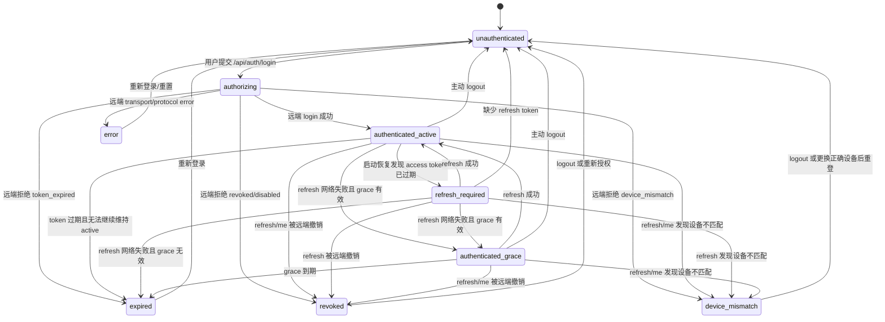

# Auth 状态机图

本文基于当前代码中的状态定义与状态迁移整理：

- 状态定义：`frontend/src/features/auth/types.ts`
- 路由门禁：`frontend/src/features/auth/AuthRouteGate.tsx`
- 后端编排：`backend/services/auth_service.py`

---

## 1. 状态列表

当前主要 AuthState：

- `unauthenticated`
- `authorizing`
- `authenticated_active`
- `authenticated_grace`
- `refresh_required`
- `revoked`
- `device_mismatch`
- `expired`
- `error`

---

## 2. 状态机总图

---

## 3. 状态解释

### `unauthenticated`

含义：
- 当前没有有效本地授权会话
- 或 refresh token 缺失且无法恢复

前端表现：
- 跳转 `/login`

---

### `authorizing`

含义：
- 已提交登录请求
- 正在等待远端认证系统返回

备注：
- 这是一个短暂的中间状态
- 主要由后端 `AuthService.login()` 写入

---

### `authenticated_active`

含义：
- 当前 machine session 有效
- 可以进入完整受保护主界面
- 可以执行受保护操作和后台任务

前端表现：
- `ProtectedAppShell` 放行

---

### `refresh_required`

含义：
- 本地发现 access token 已过期
- 需要尝试 refresh

备注：
- 这是一个恢复/续期阶段状态
- 通常不会长期停留在前端

---

### `authenticated_grace`

含义：
- 远端暂不可达或刷新失败
- 但仍处在离线宽限窗口内

前端表现：
- 只允许一部分安全页面/只读页面
- 显示宽限提示

当前路由门禁倾向：
- 可进 `/`
- 可进 `/dashboard`
- 可进 `/creative`
- 可进 `/creative/workbench`
- 其他高风险页面被导向 `/auth/grace`

---

### `revoked`

含义：
- 远端授权被撤销，或账号被禁用

前端表现：
- 跳转 `/auth/revoked`

说明：
- 这是硬拒绝状态
- 不能继续执行受保护业务操作

---

### `device_mismatch`

含义：
- 本地 device_id 与远端/持久化 device_id 不一致
- 当前机器不被视为合法授权设备

前端表现：
- 跳转 `/auth/device-mismatch`

说明：
- 这是硬拒绝状态
- 体现当前系统是“机器授权”而非纯用户登录

---

### `expired`

含义：
- token/grace 都不再有效
- 需要重新登录

前端表现：
- 跳转 `/auth/expired`

---

### `error`

含义：
- 登录或认证过程中发生 transport/protocol 异常
- 属于失败态，但不是明确的 revoked / device_mismatch / expired

前端表现：
- 通常需要用户重试或重新登录

---

## 4. 权限语义总结

按 `AuthStatusResponse` 当前语义：

| 状态 | 是否已认证 | 可读本地数据 | 可执行受保护操作 | 可跑后台任务 |
| --- | --- | --- | --- | --- |
| `unauthenticated` | 否 | 否 | 否 | 否 |
| `authorizing` | 否 | 否 | 否 | 否 |
| `authenticated_active` | 是 | 是 | 是 | 是 |
| `refresh_required` | 否 | 否 | 否 | 否 |
| `authenticated_grace` | 是 | 是 | 否 | 否 |
| `revoked` | 否 | 否 | 否 | 否 |
| `device_mismatch` | 否 | 否 | 否 | 否 |
| `expired` | 否 | 否 | 否 | 否 |
| `error` | 否 | 否 | 否 | 否 |

---

## 5. 读图结论

当前 Auth 不是单一“登录/未登录”二元模型，而是：

> **机器授权生命周期状态机**

它同时处理：

- 登录成功
- 启动恢复
- token 续期
- 离线宽限
- 远端吊销
- 设备不匹配
- 错误恢复

这也是为什么当前登录系统看起来比普通 Web 登录复杂得多。

