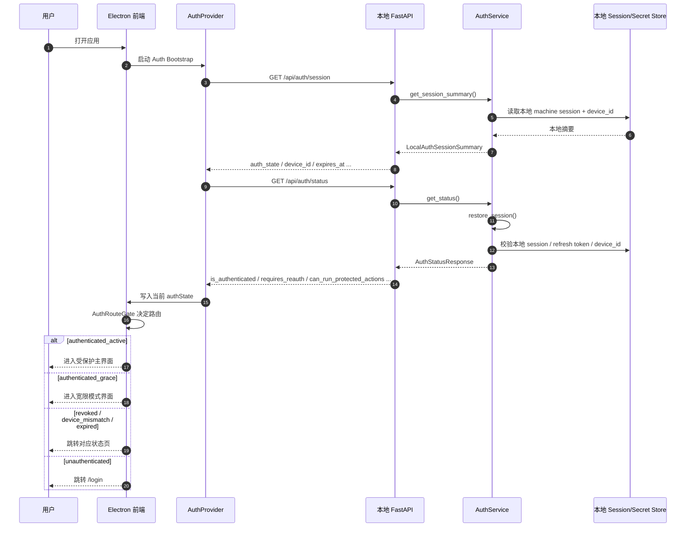
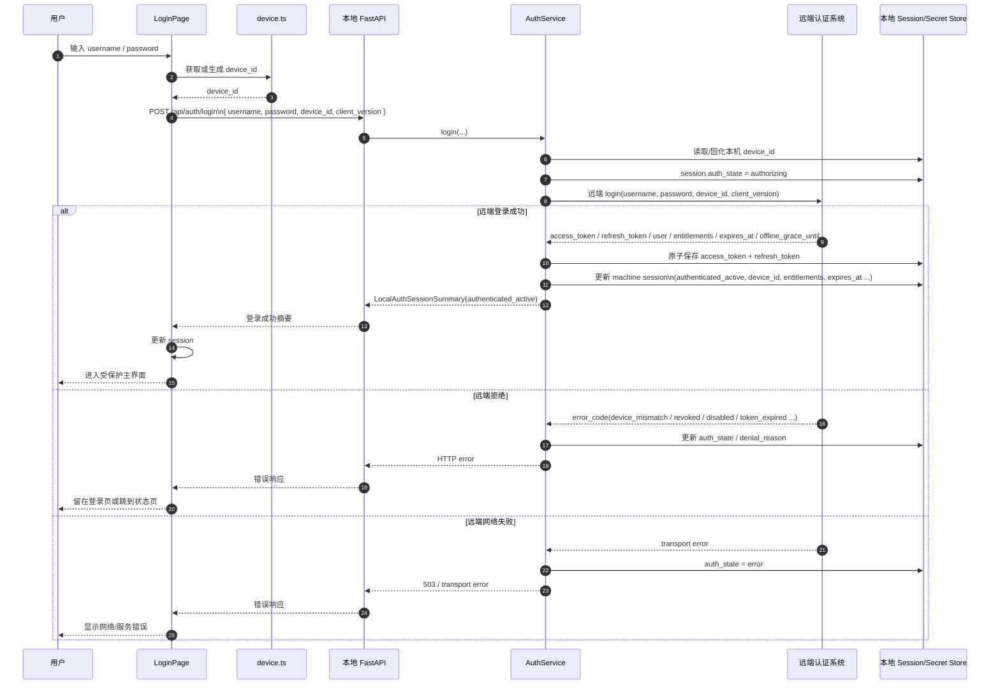
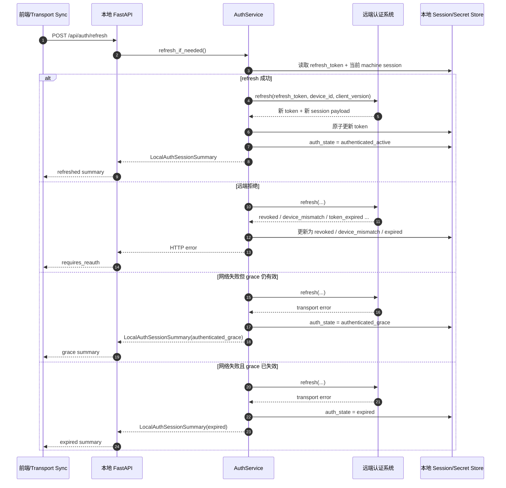

# 应用登录链路时序图

本文描述的是**应用登录（`/api/auth/*`）**，不是业务账号连接（`/api/accounts/connect/*`）。

相关代码入口：

- 前端登录页：`frontend/src/features/auth/LoginPage.tsx`
- 前端 Auth Bootstrap：`frontend/src/features/auth/AuthProvider.tsx`
- 前端路由门禁：`frontend/src/features/auth/AuthRouteGate.tsx`
- 本地 API：`backend/api/auth.py`
- 本地编排：`backend/services/auth_service.py`

---

## 1. 启动恢复时序

---

## 2. 登录提交时序

---

## 3. 刷新与宽限时序

---

## 4. 读图结论

这个登录链路不是普通的“前端表单直连远端 auth”，而是：

1. 前端只负责交互与显示  
2. 本地 FastAPI 充当 auth 代理与状态真相源  
3. AuthService 负责 session 编排、token 持久化、设备绑定、恢复与刷新  
4. 前端最终按本地 `auth_state` 来决定是否放行路由

